# dnssec-detect项目报告

这两个月，课题二主要完成了如下工作：

### 1. 扩展三级域——www.iwbtfy.top
+ 因为.top域的配置我们无法修改，所以我们扩展三级子域，通过修改二级和三级域的配置得到和修改一级和二级域相同的效果。
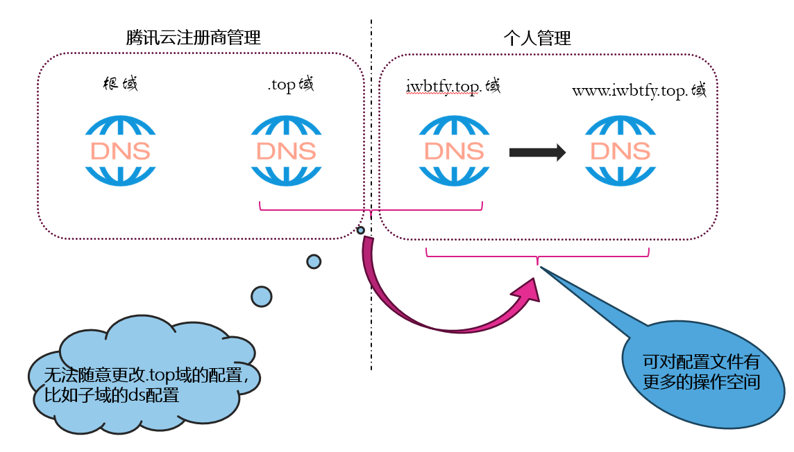

+ 扩展三级域后，我们起初使用一个子域配置多种错误，这样操作，每一次检测不同的错误，我们都需要重新进行配置错误，就是需要修改子域的域配置，
所以我们进一步使用多个子域，并且每一个子域对应一种错误，这样每次想要检测的时候就不用修改配置了，并且域名和错误是一一对应的，在进行结果分析的时候
也会清晰许多。
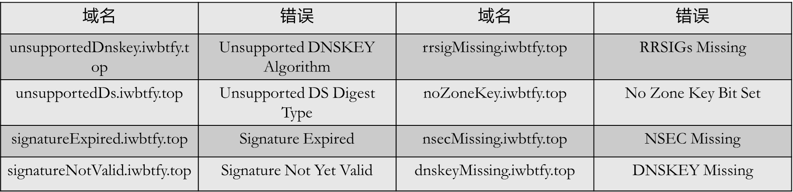

#### 1.1 子域 unsupportedDnskey.iwbtfy.top（林晖）
+ 配置/etc/named.conf文件
  ```shell
    zone "unsupportedDnskey.iwbtfy.top" IN {
      type master;
      auto-dnssec maintain;
      update-policy local;
      file "unsupportedDnskey.iwbtfy.top.zone";
      key-directory "/var/named/unsupportedDnskey_keys";	
  };
  ```
+ 配置/var/named/unsupportedDnskey.iwbtfy.top.zone文件
  ```shell
  unsupportedDnskey.iwbtfy.top.	IN	SOA	ns1	admin.unsupportedDnskey.iwbtfy.top. (
				3
				1H
				5M
				2D
				6H )
  
  unsupportedDnskey.iwbtfy.top.	IN	NS	ns1.unsupportedDnskey.iwbtfy.top.
  unsupportedDnskey.iwbtfy.top.	IN	MX  10  mail.unsupportedDnskey.iwbtfy.top.
  ns1		IN	A	123.207.59.193
  mail		IN	A	123.207.59.193
  www		IN	A	123.207.59.193
  ftp		IN	CNAME	www
  @               IN	A	123.207.59.193
  ```
+ 生成keys
  ```shell
  dnssec-keygen -f KSK -a RSASHA1 -r /dev/urandom -b 512 -n ZONE unsupportedDnskey.iwbtfy.top.
  dnssec-keygen -a RSASHA1 -r /dev/urandom -b 512 -n ZONE unsupportedDnskey.iwbtfy.top.
  
  ksk: Kunsupporteddnskey.iwbtfy.top.+005+08536
  zsk: Kunsupporteddnskey.iwbtfy.top.+005+26331
  ```
+ 将keys添加到/var/named/unsupportedDnskey.iwbtfy.top.zone
  ```shell
  vi  unsupportedDnskey.iwbtfy.top.zone 添加
  $INCLUDE "/var/named/unsupportedDnskey_keys/Kunsupporteddnskey.iwbtfy.top.+005+08536.key"
  $INCLUDE "/var/named/unsupportedDnskey_keys/Kunsupporteddnskey.iwbtfy.top.+005+26331.key" 
  ```
+ 用keys签名zone
  ```shell
  dnssec-signzone -K /var/named/unsupportedDnskey_keys -o unsupportedDnskey.iwbtfy.top. /var/named/unsupportedDnskey.iwbtfy.top.zone
  ```
+ 修改/etc/named.conf文件
  ```shell
  zone "unsupportedDnskey.iwbtfy.top" IN {
    type master;
    auto-dnssec maintain;
    update-policy local;
    file "unsupportedDnskey.iwbtfy.top.zone";
    key-directory "/var/named/unsupportedDnskey_keys";	
  };
  ```
+ 生成ds记录并且将ds记录添加到父域
  ```shell
  dnssec-dsfromkey -2 Kunsupporteddnskey.iwbtfy.top.+005+08536.key
  
  unsupportedDnskey.iwbtfy.top. IN DS 8536 5 2 543B066F2A02B7B91B7575861DF32AEDF562D274FD304F33579EFE11190CEE52
  ```

#### 1.2 子域 unsupportedDs.iwbtfy.top（林晖）
+ 配置/etc/named.conf文件
  ```shell
    zone "unsupportedDs.iwbtfy.top" IN {
      type master;
      auto-dnssec maintain;
      update-policy local;
      file "unsupportedDs.iwbtfy.top.zone";
      key-directory "/var/named/unsupportedDs_keys";	
  };
  ```
+ 配置/var/named/unsupportedDs.iwbtfy.top.zone文件
  ```shell
  unsupportedDs.iwbtfy.top.	IN	SOA	ns1	admin.unsupportedDs.iwbtfy.top. (
				3
				1H
				5M
				2D
				6H )
  
  unsupportedDs.iwbtfy.top.	IN	NS	ns1.unsupportedDs.iwbtfy.top.
  unsupportedDs.iwbtfy.top.	IN	MX  10  mail.unsupportedDs.iwbtfy.top.
  ns1		IN	A	123.207.59.193
  mail		IN	A	123.207.59.193
  www		IN	A	123.207.59.193
  ftp		IN	CNAME	www
  @               IN	A	123.207.59.193
  ```
+ 生成keys
  ```shell
  dnssec-keygen -f KSK -a RSASHA1 -r /dev/urandom -b 512 -n ZONE unsupportedDs.iwbtfy.top.
  dnssec-keygen -a RSASHA1 -r /dev/urandom -b 512 -n ZONE unsupportedDs.iwbtfy.top.
  
  ksk: KunsupportedDs.iwbtfy.top.+005+08536
  zsk: KunsupportedDs.iwbtfy.top.+005+26331
  ```
+ 将keys添加到/var/named/unsupportedDs.iwbtfy.top.zone
  ```shell
  vi  unsupportedDs.iwbtfy.top.zone 添加
  $INCLUDE "/var/named/unsupportedDs_keys/KunsupportedDs.iwbtfy.top.+005+08536.key"
  $INCLUDE "/var/named/unsupportedDs_keys/KunsupportedDs.iwbtfy.top.+005+26331.key" 
  ```
+ 用keys签名zone
  ```shell
  dnssec-signzone -K /var/named/unsupportedDs_keys -o unsupportedDs.iwbtfy.top. /var/named/unsupportedDs.iwbtfy.top.zone
  ```
+ 修改/etc/named.conf文件
  ```shell
  zone "unsupportedDs.iwbtfy.top" IN {
    type master;
    auto-dnssec maintain;
    update-policy local;
    file "unsupportedDs.iwbtfy.top.zone";
    key-directory "/var/named/unsupportedDs_keys";	
  };
  ```
+ 生成ds记录并且将ds记录添加到父域
  ```shell
  dnssec-dsfromkey -2 KunsupportedDs.iwbtfy.top.+005+08536.key
  
  unsupportedDs.iwbtfy.top. IN DS 8536 5 2 543B066F2A02B7B91B7575861DF32AEDF562D274FD304F33579EFE11190CEE52
  ```

#### 1.3 子域 signatureExpired.iwbtfy.top（林晖）
+ 配置/etc/named.conf文件
  ```shell
    zone "signatureExpired.iwbtfy.top" IN {
      type master;
      auto-dnssec maintain;
      update-policy local;
      file "signatureExpired.iwbtfy.top.zone";
      key-directory "/var/named/signatureExpired_keys";	
  };
  ```
+ 配置/var/named/signatureExpired.iwbtfy.top.zone文件
  ```shell
  signatureExpired.iwbtfy.top.	IN	SOA	ns1	admin.signatureExpired.iwbtfy.top. (
				3
				1H
				5M
				2D
				6H )
  
  signatureExpired.iwbtfy.top.	IN	NS	ns1.signatureExpired.iwbtfy.top.
  signatureExpired.iwbtfy.top.	IN	MX  10  mail.signatureExpired.iwbtfy.top.
  ns1		IN	A	123.207.59.193
  mail		IN	A	123.207.59.193
  www		IN	A	123.207.59.193
  ftp		IN	CNAME	www
  @               IN	A	123.207.59.193
  ```
+ 生成keys
  ```shell
  dnssec-keygen -f KSK -a RSASHA1 -r /dev/urandom -b 512 -n ZONE signatureExpired.iwbtfy.top.
  dnssec-keygen -a RSASHA1 -r /dev/urandom -b 512 -n ZONE signatureExpired.iwbtfy.top.
  
  ksk: KsignatureExpired.iwbtfy.top.+005+08536
  zsk: KsignatureExpired.iwbtfy.top.+005+26331
  ```
+ 将keys添加到/var/named/signatureExpired.iwbtfy.top.zone
  ```shell
  vi  signatureExpired.iwbtfy.top.zone 添加
  $INCLUDE "/var/named/unsupportedDnskey_keys/KsignatureExpired.iwbtfy.top.+005+08536.key"
  $INCLUDE "/var/named/unsupportedDnskey_keys/KsignatureExpired.iwbtfy.top.+005+26331.key" 
  ```
+ 用keys签名zone
  ```shell
  dnssec-signzone -K /var/named/signatureExpired_keys -o signatureExpired.iwbtfy.top. /var/named/signatureExpired.iwbtfy.top.zone
  ```
+ 修改/etc/named.conf文件
  ```shell
  zone "signatureExpired.iwbtfy.top" IN {
    type master;
    auto-dnssec maintain;
    update-policy local;
    file "signatureExpired.iwbtfy.top.zone";
    key-directory "/var/named/signatureExpired_keys";	
  };
  ```
+ 生成ds记录并且将ds记录添加到父域
  ```shell
  dnssec-dsfromkey -2 KsignatureExpired.iwbtfy.top.+005+08536.key
  
  signatureExpired.iwbtfy.top. IN DS 8536 5 2 543B066F2A02B7B91B7575861DF32AEDF562D274FD304F33579EFE11190CEE52
  ```

#### 1.4 子域 signatureNotValid.iwbtfy.top（林晖）
+ 配置/etc/named.conf文件
  ```shell
    zone "signatureNotValid.iwbtfy.top" IN {
      type master;
      auto-dnssec maintain;
      update-policy local;
      file "signatureNotValid.iwbtfy.top.zone";
      key-directory "/var/named/signatureNotValid_keys";	
  };
  ```
+ 配置/var/named/signatureNotValid.iwbtfy.top.zone文件
  ```shell
  signatureNotValid.iwbtfy.top.	IN	SOA	ns1	admin.signatureNotValid.iwbtfy.top. (
				3
				1H
				5M
				2D
				6H )
  
  signatureNotValid.iwbtfy.top.	IN	NS	ns1.signatureNotValid.iwbtfy.top.
  signatureNotValid.iwbtfy.top.	IN	MX  10  mail.signatureNotValid.iwbtfy.top.
  ns1		IN	A	123.207.59.193
  mail		IN	A	123.207.59.193
  www		IN	A	123.207.59.193
  ftp		IN	CNAME	www
  @               IN	A	123.207.59.193
  ```
+ 生成keys
  ```shell
  dnssec-keygen -f KSK -a RSASHA1 -r /dev/urandom -b 512 -n ZONE signatureNotValid.iwbtfy.top.
  dnssec-keygen -a RSASHA1 -r /dev/urandom -b 512 -n ZONE signatureNotValid.iwbtfy.top.
  
  ksk: KsignatureNotValid.iwbtfy.top.+005+08536
  zsk: KsignatureNotValid.iwbtfy.top.+005+26331
  ```
+ 将keys添加到/var/named/signatureNotValid.iwbtfy.top.zone
  ```shell
  vi  signatureNotValid.iwbtfy.top.zone 添加
  $INCLUDE "/var/named/signatureNotValid_keys/KsignatureNotValid.iwbtfy.top.+005+08536.key"
  $INCLUDE "/var/named/signatureNotValid_keys/KsignatureNotValid.iwbtfy.top.+005+26331.key" 
  ```
+ 用keys签名zone
  ```shell
  dnssec-signzone -K /var/named/signatureNotValid_keys -o signatureNotValid.iwbtfy.top. /var/named/signatureNotValid.iwbtfy.top.zone
  ```
+ 修改/etc/named.conf文件
  ```shell
  zone "signatureNotValid.iwbtfy.top" IN {
    type master;
    auto-dnssec maintain;
    update-policy local;
    file "signatureNotValid.iwbtfy.top.zone";
    key-directory "/var/named/signatureNotValid_keys";	
  };
  ```
+ 生成ds记录并且将ds记录添加到父域
  ```shell
  dnssec-dsfromkey -2 KsignatureNotValid.iwbtfy.top.+005+08536.key
  
  signatureNotValid.iwbtfy.top. IN DS 8536 5 2 543B066F2A02B7B91B7575861DF32AEDF562D274FD304F33579EFE11190CEE52
  ```


#### 1.5 子域 rrsigMissing.iwbtfy.top（菲帆）
+ 配置/etc/named.conf文件
  ```shell
    zone "rrsigMissing.iwbtfy.top" IN {
      type master;
      auto-dnssec maintain;
      update-policy local;
      file "rrsigMissing.iwbtfy.top.zone";
      key-directory "/var/named/rrsigMissing_keys";	
  };
  ```
+ 配置/var/named/rrsigMissing.iwbtfy.top.zone文件
  ```shell
  rrsigMissing.iwbtfy.top.	IN	SOA	ns1	admin.rrsigMissing.iwbtfy.top. (
				3
				1H
				5M
				2D
				6H )
  
  rrsigMissing.iwbtfy.top.	IN	NS	ns1.rrsigMissing.iwbtfy.top.
  rrsigMissing.iwbtfy.top.	IN	MX  10  mail.rrsigMissing.iwbtfy.top.
  ns1		IN	A	123.207.59.193
  mail		IN	A	123.207.59.193
  www		IN	A	123.207.59.193
  ftp		IN	CNAME	www
  @               IN	A	123.207.59.193
  ```
+ 生成keys
  ```shell
  dnssec-keygen -f KSK -a RSASHA1 -r /dev/urandom -b 512 -n ZONE rrsigMissing.iwbtfy.top.
  dnssec-keygen -a RSASHA1 -r /dev/urandom -b 512 -n ZONE rrsigMissing.iwbtfy.top.
  
  ksk: KrrsigMissing.iwbtfy.top.+005+08536
  zsk: KrrsigMissing.iwbtfy.top.+005+26331
  ```
+ 将keys添加到/var/named/rrsigMissing.iwbtfy.top.zone
  ```shell
  vi  rrsigMissing.iwbtfy.top.zone 添加
  $INCLUDE "/var/named/rrsigMissing_keys/KrrsigMissing.iwbtfy.top.+005+08536.key"
  $INCLUDE "/var/named/rrsigMissing_keys/KrrsigMissing.iwbtfy.top.+005+26331.key" 
  ```
+ 用keys签名zone
  ```shell
  dnssec-signzone -K /var/named/rrsigMissing_keys -o rrsigMissing.iwbtfy.top. /var/named/rrsigMissing.iwbtfy.top.zone
  ```
+ 修改/etc/named.conf文件
  ```shell
  zone "rrsigMissing.iwbtfy.top" IN {
    type master;
    auto-dnssec maintain;
    update-policy local;
    file "rrsigMissing.iwbtfy.top.zone";
    key-directory "/var/named/rrsigMissing_keys";	
  };
  ```
+ 生成ds记录并且将ds记录添加到父域
  ```shell
  dnssec-dsfromkey -2 KrrsigMissing.iwbtfy.top.+005+08536.key
  
  rrsigMissing.iwbtfy.top. IN DS 8536 5 2 543B066F2A02B7B91B7575861DF32AEDF562D274FD304F33579EFE11190CEE52
  ```

#### 1.6 子域 noZoneKey.iwbtfy.top（菲帆）
+ 配置/etc/named.conf文件
  ```shell
    zone "noZoneKey.iwbtfy.top" IN {
      type master;
      auto-dnssec maintain;
      update-policy local;
      file "noZoneKey.iwbtfy.top.zone";
      key-directory "/var/named/noZoneKey_keys";	
  };
  ```
+ 配置/var/named/noZoneKey.iwbtfy.top.zone文件
  ```shell
  noZoneKey.iwbtfy.top.	IN	SOA	ns1	admin.noZoneKey.iwbtfy.top. (
				3
				1H
				5M
				2D
				6H )
  
  noZoneKey.iwbtfy.top.	IN	NS	ns1.noZoneKey.iwbtfy.top.
  noZoneKey.iwbtfy.top.	IN	MX  10  mail.noZoneKey.iwbtfy.top.
  ns1		IN	A	123.207.59.193
  mail		IN	A	123.207.59.193
  www		IN	A	123.207.59.193
  ftp		IN	CNAME	www
  @               IN	A	123.207.59.193
  ```
+ 生成keys
  ```shell
  dnssec-keygen -f KSK -a RSASHA1 -r /dev/urandom -b 512 -n ZONE noZoneKey.iwbtfy.top.
  dnssec-keygen -a RSASHA1 -r /dev/urandom -b 512 -n ZONE noZoneKey.iwbtfy.top.
  
  ksk: KnoZoneKey.iwbtfy.top.+005+08536
  zsk: KnoZoneKey.iwbtfy.top.+005+26331
  ```
+ 将keys添加到/var/named/noZoneKey.iwbtfy.top.zone
  ```shell
  vi  noZoneKey.iwbtfy.top.zone 添加
  $INCLUDE "/var/named/noZoneKey_keys/KnoZoneKey.iwbtfy.top.+005+08536.key"
  $INCLUDE "/var/named/noZoneKey_keys/KnoZoneKey.iwbtfy.top.+005+26331.key" 
  ```
+ 用keys签名zone
  ```shell
  dnssec-signzone -K /var/named/noZoneKey_keys -o noZoneKey.iwbtfy.top. /var/named/noZoneKey.iwbtfy.top.zone
  ```
+ 修改/etc/named.conf文件
  ```shell
  zone "noZoneKey.iwbtfy.top" IN {
    type master;
    auto-dnssec maintain;
    update-policy local;
    file "noZoneKey.iwbtfy.top.zone";
    key-directory "/var/named/noZoneKey_keys";	
  };
  ```
+ 生成ds记录并且将ds记录添加到父域
  ```shell
  dnssec-dsfromkey -2 KnoZoneKey.iwbtfy.top.+005+08536.key
  
  noZoneKey.iwbtfy.top. IN DS 8536 5 2 543B066F2A02B7B91B7575861DF32AEDF562D274FD304F33579EFE11190CEE52
  ```

#### 1.7 子域 nsecMissing.iwbtfy.top（菲帆）
+ 配置/etc/named.conf文件
  ```shell
    zone "nsecMissing.iwbtfy.top" IN {
      type master;
      auto-dnssec maintain;
      update-policy local;
      file "nsecMissing.iwbtfy.top.zone";
      key-directory "/var/named/nsecMissing_keys";	
  };
  ```
+ 配置/var/named/nsecMissing.iwbtfy.top.zone文件
  ```shell
  nsecMissing.iwbtfy.top.	IN	SOA	ns1	admin.nsecMissing.iwbtfy.top. (
				3
				1H
				5M
				2D
				6H )
  
  nsecMissing.iwbtfy.top.	IN	NS	ns1.nsecMissing.iwbtfy.top.
  nsecMissing.iwbtfy.top.	IN	MX  10  mail.nsecMissing.iwbtfy.top.
  ns1		IN	A	123.207.59.193
  mail		IN	A	123.207.59.193
  www		IN	A	123.207.59.193
  ftp		IN	CNAME	www
  @               IN	A	123.207.59.193
  ```
+ 生成keys
  ```shell
  dnssec-keygen -f KSK -a RSASHA1 -r /dev/urandom -b 512 -n ZONE nsecMissing.iwbtfy.top.
  dnssec-keygen -a RSASHA1 -r /dev/urandom -b 512 -n ZONE nsecMissing.iwbtfy.top.
  
  ksk: KnsecMissing.iwbtfy.top.+005+08536
  zsk: KnsecMissing.iwbtfy.top.+005+26331
  ```
+ 将keys添加到/var/named/nsecMissing.iwbtfy.top.zone
  ```shell
  vi  nsecMissing.iwbtfy.top.zone 添加
  $INCLUDE "/var/named/nsecMissing_keys/KnsecMissing.iwbtfy.top.+005+08536.key"
  $INCLUDE "/var/named/nsecMissing_keys/KnsecMissing.iwbtfy.top.+005+26331.key" 
  ```
+ 用keys签名zone
  ```shell
  dnssec-signzone -K /var/named/nsecMissing_keys -o nsecMissing.iwbtfy.top. /var/named/nsecMissing.iwbtfy.top.zone
  ```
+ 修改/etc/named.conf文件
  ```shell
  zone "nsecMissing.iwbtfy.top" IN {
    type master;
    auto-dnssec maintain;
    update-policy local;
    file "nsecMissing.iwbtfy.top.zone";
    key-directory "/var/named/nsecMissing_keys";	
  };
  ```
+ 生成ds记录并且将ds记录添加到父域
  ```shell
  dnssec-dsfromkey -2 nsecMissing.iwbtfy.top.+005+08536.key
  
  nsecMissing.iwbtfy.top. IN DS 8536 5 2 543B066F2A02B7B91B7575861DF32AEDF562D274FD304F33579EFE11190CEE52
  ```

#### 1.8 子域 dnskeyMissing.iwbtfy.top（菲帆）
+ 配置/etc/named.conf文件
  ```shell
    zone "dnskeyMissing.iwbtfy.top" IN {
      type master;
      auto-dnssec maintain;
      update-policy local;
      file "dnskeyMissing.iwbtfy.top.zone";
      key-directory "/var/named/dnskeyMissing_keys";	
  };
  ```
+ 配置/var/named/dnskeyMissing.iwbtfy.top.zone文件
  ```shell
  dnskeyMissing.iwbtfy.top.	IN	SOA	ns1	admin.dnskeyMissing.iwbtfy.top. (
				3
				1H
				5M
				2D
				6H )
  
  dnskeyMissing.iwbtfy.top.	IN	NS	ns1.dnskeyMissing.iwbtfy.top.
  dnskeyMissing.iwbtfy.top.	IN	MX  10  mail.dnskeyMissing.iwbtfy.top.
  ns1		IN	A	123.207.59.193
  mail		IN	A	123.207.59.193
  www		IN	A	123.207.59.193
  ftp		IN	CNAME	www
  @               IN	A	123.207.59.193
  ```
+ 生成keys
  ```shell
  dnssec-keygen -f KSK -a RSASHA1 -r /dev/urandom -b 512 -n ZONE dnskeyMissing.iwbtfy.top.
  dnssec-keygen -a RSASHA1 -r /dev/urandom -b 512 -n ZONE dnskeyMissing.iwbtfy.top.
  
  ksk: KdnskeyMissing.iwbtfy.top.+005+08536
  zsk: KdnskeyMissing.iwbtfy.top.+005+26331
  ```
+ 将keys添加到/var/named/dnskeyMissing.iwbtfy.top.zone
  ```shell
  vi  dnskeyMissing.iwbtfy.top.zone 添加
  $INCLUDE "/var/named/dnskeyMissing_keys/KdnskeyMissing.iwbtfy.top.+005+08536.key"
  $INCLUDE "/var/named/dnskeyMissing_keys/KdnskeyMissing.iwbtfy.top.+005+26331.key" 
  ```
+ 用keys签名zone
  ```shell
  dnssec-signzone -K /var/named/dnskeyMissing_keys -o dnskeyMissing.iwbtfy.top. /var/named/dnskeyMissing.iwbtfy.top.zone
  ```
+ 修改/etc/named.conf文件
  ```shell
  zone "dnskeyMissing.iwbtfy.top" IN {
    type master;
    auto-dnssec maintain;
    update-policy local;
    file "dnskeyMissing.iwbtfy.top.zone";
    key-directory "/var/named/dnskeyMissing_keys";	
  };
  ```
+ 生成ds记录并且将ds记录添加到父域
  ```shell
  dnssec-dsfromkey -2 dnskeyMissing.iwbtfy.top.+005+08536.key
  
  dnskeyMissing.iwbtfy.top. IN DS 8536 5 2 543B066F2A02B7B91B7575861DF32AEDF562D274FD304F33579EFE11190CEE52
  ```


---
由于八个子域的配置过程类似且比较麻烦，如果一个一个手动配置会很繁琐，于是我们编写了shell脚本进行批量处理。 只要运行下边命令就可以一键配置。（菲帆，林晖）

> 该代码具有较好的批量处理性，复用性强，可以考虑申请专利

```shell
./domain_configuration.sh 子域名称
```
shell源码：
```shell
#!/bin/bash

echo "sub_domain_name: $1"

# 相关配置文件的路径
etc_directory="/etc/named.conf"
zone_directory="/var/named/$1.iwbtfy.top.zone"
key_directory="/var/named/$1_keys"
iwbtfy_zone_directory="/var/named/iwbtfy.top.zone"
iwbtfy_key_directory="/var/named/keys"

# 创建一个子域的域配置文件
touch $zone_directory

# 写入域配置
echo "\$TTL 600
$1.iwbtfy.top.	IN	SOA	ns	admin.$1.iwbtfy.top. (
                3
                1H
                5M
                2D
                6H )
$1.iwbtfy.top.	IN	NS	ns.$1.iwbtfy.top.
$1.iwbtfy.top.	IN	MX  10  mail.$1.iwbtfy.top.
ns	           	IN	A	123.207.59.193
mail		        IN	A	123.207.59.193
@               IN	A	123.207.59.193" >> $zone_directory

# 创建子域对应的keys的文件夹
mkdir $key_directory

# 生成keys
cd $key_directory
# dnssec-keygen -f KSK -a RSASHA1 -r /dev/urandom -b 512 -n ZONE $1.iwbtfy.top.
ksk=$(dnssec-keygen -f KSK -a RSASHA1 -r /dev/urandom -b 512 -n ZONE $1.iwbtfy.top. | grep iwbtfy)
echo $ksk
# dnssec-keygen -a RSASHA1 -r /dev/urandom -b 512 -n ZONE $1.iwbtfy.top.
zsk=$(dnssec-keygen -a RSASHA1 -r /dev/urandom -b 512 -n ZONE $1.iwbtfy.top. | grep iwbtfy)
echo $zsk

# 将keys写入到域配置中
echo "\$INCLUDE \"$key_directory/$ksk.key\"
\$INCLUDE \"$key_directory/$zsk.key\" " >> $zone_directory

# 生成ds记录
ds=$(dnssec-dsfromkey -2 $ksk.key)
echo $ds
# 将ds记录写入上一级的域配置中
echo "$1             IN      NS      ns1.$1
ns1.$1         IN      A       123.207.59.193
$ds" >> $iwbtfy_zone_directory

# 使用key签名域配置
dnssec-signzone -K $key_directory -o $1.iwbtfy.top. /var/named/$1.iwbtfy.top.zone
dnssec-signzone -K $iwbtfy_key_directory -o iwbtfy.top. /var/named/iwbtfy.top.zone

# 在/etc/named.conf添加这个子域
echo "zone \"$1.iwbtfy.top\" IN {
  type master;
  auto-dnssec maintain;
  update-policy local;
  file \"$1.iwbtfy.top.zone.signed\";
  key-directory \"$key_directory\";
};" >> $etc_directory
```

+ 脚本配置运行流程图 （菲帆，林晖）：

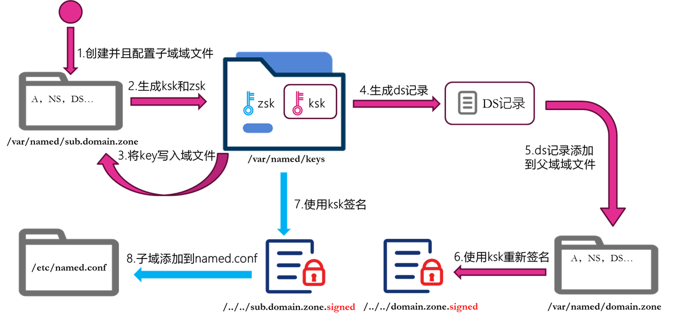

## 2. 安装edns

通过修改dig版本，使其支持edns，通过edns返回的错误代码统一转换为error_code，方便后续系统统一化输出结果。

### 2.3.1 子域 unsupportedDnskey.iwbtfy.top （林晖）

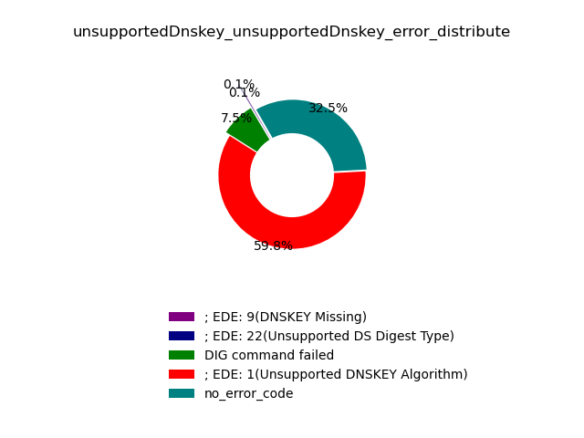

### 2.3.2 子域 unsupportedDs.iwbtfy.top （林晖）

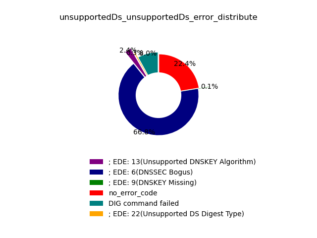

### 2.3.3 子域 signatureExpired.iwbtfy.top （林晖）     

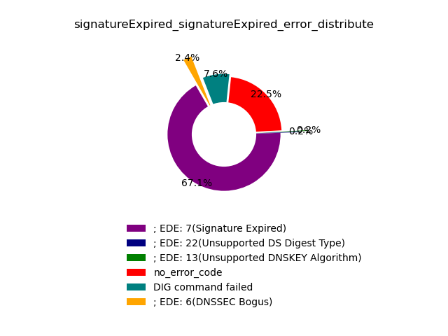

### 2.3.4 子域 signatureNotValid.iwbtfy.top （林晖）    

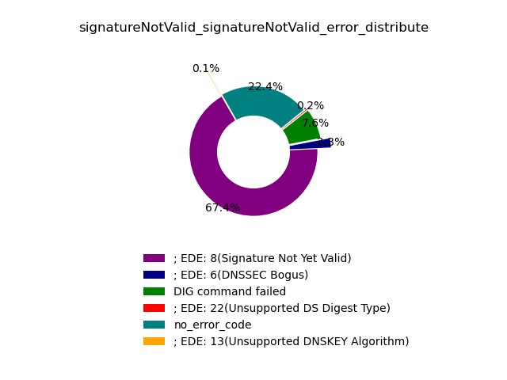

### 2.3.5 子域 rrsigMissing.iwbtfy.top （菲帆）         

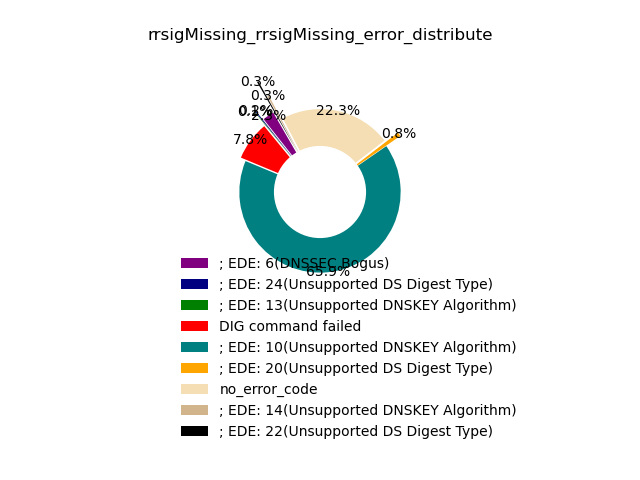

### 2.3.6 子域 noZoneKey.iwbtfy.top （菲帆）

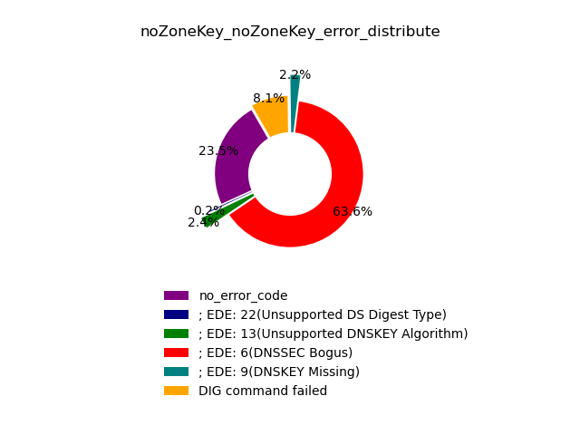

### 2.3.7 子域 nsecMissing.iwbtfy.top （菲帆）

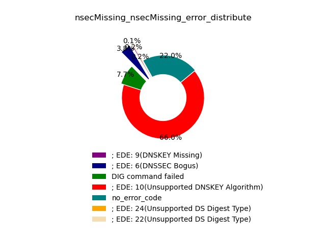

### 2.3.8 子域 dnskeyMissing.iwbtfy.top （菲帆）        

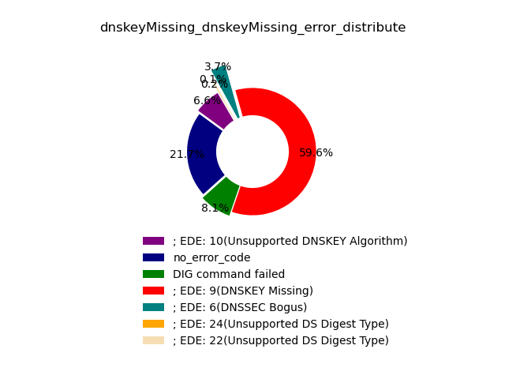


## 3. 搜索RFC文档

按照耿老师的要求查看了RFC相关标准，没有看到涉及对DNSSEC错误配置进行提醒的标准。RFC7646（https://rfc2cn.com/rfc7646.html）中定义了负信任锚（NTA），NTA在验证DNS递归解析器上进行本地配置，以保护最终用户不受DNSSEC相关权威名称服务器操作错误的影响。不过这个标准主要是改善用户体验，防止客户在遇到DNSSEC错误配置导致无法访问域时投诉ISP的性能故障。

## 4. 递归侧搭建

参考陈老师在本地搭建的递归侧DNS服务器，只需要将服务器的配置文件中添加一个支持递归的选项即可，但是递归侧的错误配置目前还不大清楚具体的意思。

## 5. 系统搭建

开始设计搭建一个完整的用户操作系统，功能主要为上传一个DNS递归服务器的数据集到系统，后台调用代码对配置好的子域分别进行探测，最后在前台输出结果的可视化。