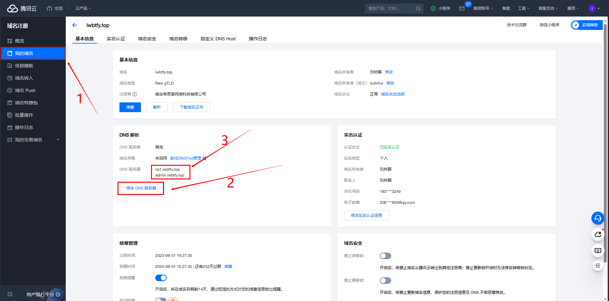
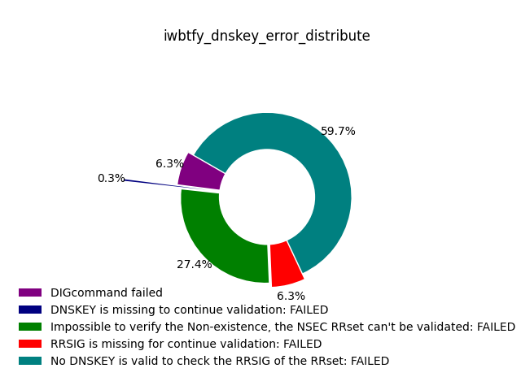
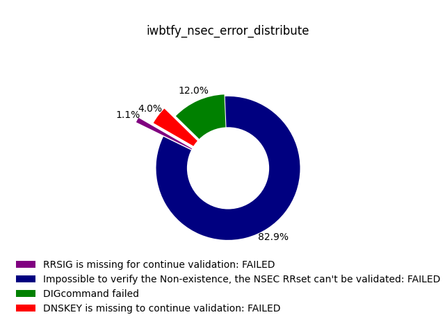
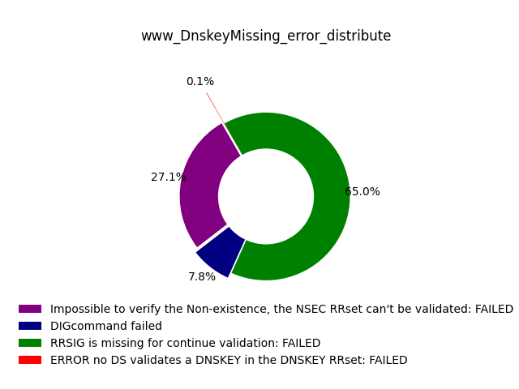
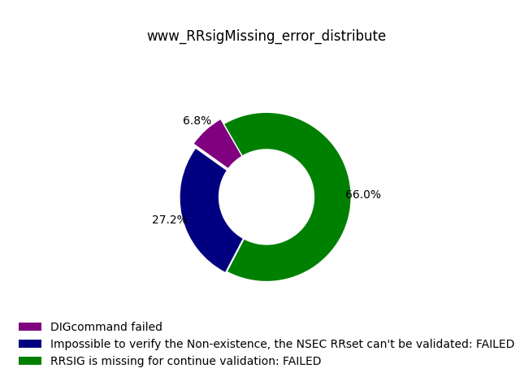
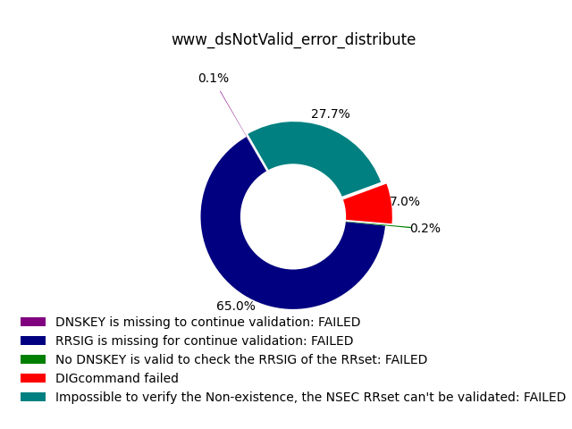
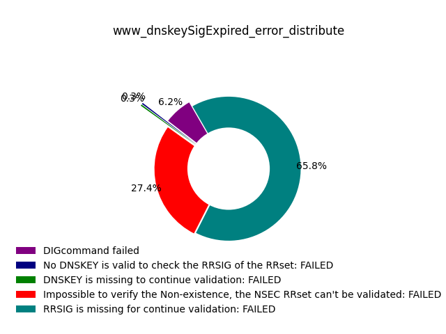
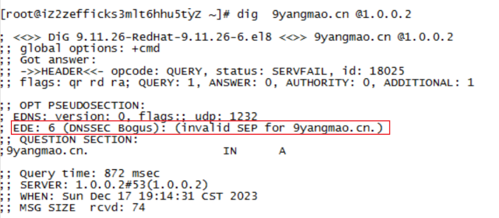

# dnssec-detect项目年度报告

----------------------

+ illuminate

+ iwbtfy

----------------------

## 1.项目背景与要求
DNSSEC是一种dns的安全扩展技术， 通过提供源身份验证来防止 DNS 数据欺骗，并使用公钥加密确保数据完整性和不存在身份验证。尽管保护像 DNS 这样对互联网至关重要的技术的重要性是显而易见的，但 DNSSEC 的实施增加了已部署的 DNS 基础设施的复杂性，这可能会导致配置错误，而对于支持dnssecc的递归服务器来说，能否验证出这些错误是保证dns是否安全的重要前提。 
本项目研究加密递归解析服务器错误配置检测方法，并研发原型系统，对开放的重要加密递归解析服务器进行配置错误分析。 DNSSEC的配置错误主要体现在权威域名的错误配置，本项目将基于RFC8914等标准，全面梳理DNSSEC的错误配置类型，拟搭建测试环境，将多个支持DNSSEC的权威域名设置不同错误配置，通过命令行和脚本的形式发数据包请求，对开放的支持DNSSEC的重要递归解析服务器进行探测，分析递归解析服务器是否提供相应的错误提示，以判定递归服务器对DNSSEC配置错误是否有效验证。
### 1.1 梳理错误类型

| INFO-CODE   |           PURPOSE            |                                                               DESCRIPTION                                                               |
|-------------|:----------------------------:|:---------------------------------------------------------------------------------------------------------------------------------------:|
| 0           |         other error          |                                                   does not match known extended error                                                   |
| 1           | Unsupported DNSKEY Algorithm |                                       DNSKEY RRset contained only unsupported DNSSEC algorithms.                                        |
| 2           |  Unsupported DS Digest Type  |                                           a DS RRset contained only unsupported Digest Types.                                           |
| 3           |         stale Answer         |                                  The resolver was unable to resolve the answer within its time limits                                   |
| 4           |        Forged Answer         |                                                provide a forged answer for some reasons                                                 |
| 5           |     DNSSEC Indeterminate     |                                     DNSSEC validation by resolver ended in the indeterminate state                                      |
| 6           |         DNSSEC Bogus         |                                         DNSSEC validation by resolver ended in the bogus state                                          |
| 7           |      Signature Expired       |                                   no signatures are presently valid and some (often all) are expired                                    |
| 8           |   Signature Not Yet Valid    |                                 no signatures are presently valid and at least some are not yet valid.                                  |
| 9           |        DNSKEY Missing        |                  A DS record existed at a parent, but no supported matching DNSKEY record could be found for the child                  |
| 10          |        RRSIGs Missing        |                               no RRSIGs could be found for at least one RRset where RRSIGs were expected.                               |
| 11          |     No Zone Key Bit Set      |                                                   no Zone Key Bit was set in a DNSKEY                                                   |
| 12          |         NSEC Missing         |                              the requested data was missing and a covering NSEC or NSEC3 was not provided.                              |
| 13          |         Cached Error         |                                      The resolver is returning the SERVFAIL RCODE from its cache.                                       |
| 14          |          Not Ready           |                  The server is unable to answer the query, as it was not fully functional when the query was received.                  |
| 15          |           Blocked            |                           The server is unable to respond to the request because the domain is on a blocklist                           |
| 16          |           Censored           | The server is unable to respond to the request because the domain is on a blocklist due to an external requirement imposed by an entity |
| 17          |           Filtered           |                                     the request domain is on a blocklist as requested by the client                                     |
| 18          |          Prohibited          |                          a query from an "unauthorized" client can annotate its REFUSED message with this code                          |
| 19          |    Stale NXDomain Answer     |                                             answer with a previously cached NXDOMAIN answer                                             |
| 20          |      Not Authoritative       |                                                                                                                                         |
| 21          |        Not Supported         |                                            The requested operation or query is not supported                                            |
| 22          |    No Reachable Authority    |               The resolver could not reach any of the authoritative name servers (or they potentially refused to reply).                |
| 23          |        Network Error         |                                An unrecoverable error occurred while communicating with another server.                                 |
| 24          |         Invalid Data         |                    The authoritative server cannot answer with data for a zone it is otherwise configured to support                    |
| 25-49151    |          Unassigned          |                                                                                                                                         |
| 49151-65535 |   reserved for private use   |                                                                                                                                         |

### 1.2 配置梳理的错误并且验证服务器是否可以检测错误

+ 在梳理完错误的基础上，拟搭建测试环境，将多个支持DNSSEC的权威域名设置不同错误配置，通过命令行和脚本的形式发数据包请求，对开放的支持DNSSEC的重要递归解析服务器进行探测，
  分析递归解析服务器是否提供相应的错误提示，以判定递归服务器对DNSSEC配置错误是否有效验证。

## 2.项目方案

**首先**，我们基于 RFC8914 等标准，全面梳理DNSSEC的错误配置类型；
**接着**，我们搭建了域名iwbtfy.top，配置好了可以配置的相关错误；
**同时**，为了配置更多的错误，我们扩展到三级域，并且进行相应的配置；
**然后**，我们从全球前百万的dns服务器表中筛选了支持dnssec的递归服务器；
**最后**，编写好python脚本探测程序，以及python结果统计程序，对这一错误进行检错统计。大致方案流程如下图：


### 2.1 环境准备

------

+ 一台腾讯云服务器：123.207.59.193
+ 一个腾讯云的域名：iwbtfy.top

------

### 2.2 配置域名iwbtfy.top

**1. 将租借的iwbtfy.top域名解析的dns服务器指向租借的腾讯云服务器**

**2. 在腾讯云服务器中配置该域名的域配置文件，使其可以成功解析域名**

+ 下载安装bind
  ```shell
  yum install bind -y
  ```
+ 配置/etc/named.conf文件
  ```c
  zone "iwbtfy.top" IN {
      type master;
      auto-dnssec maintain;
      update-policy local;
      file "iwbtfy.top.zone";
      key-directory "/var/named/keys";
  };
  ```
+ 配置/var/named/iwbtfy.top.zone文件
  ```C
  $TTL 600
  iwbtfy.top.	IN	SOA	ns	admin.iwbtfy.top. (
                  3
                  1H
                  5M
                  2D
                  6H )
  iwbtfy.top.	IN	NS	ns.iwbtfy.top.
  iwbtfy.top.	IN	MX  10  mail.iwbtfy.top.
  ns		IN	A	123.207.59.193
  mail		IN	A	123.207.59.193
  ;www		IN	A	123.207.59.193
  ;ftp		IN	CNAME	www
  @               IN	A	123.207.59.193
  www             IN      NS      ns1.www
  ns1.www         IN      A       123.207.59.193
  ```

**3. 在腾讯云服务器中进一步配置该域名的dnssec配置**

+ 生成keys
  ```shell
  mkdir  /var/named/keys                       # 创建文件夹
  cd  /var/named/keys
  dnssec-keygen -f KSK -a RSASHA1 -r /dev/urandom -b 512 -n ZONE iwbtfy.top.
  dnssec-keygen -a RSASHA1 -r /dev/urandom -b 512 -n ZONE iwbtfy.top.
  
  kSK  Kiwbtfy.top.+005+16429.key
  ZSK  Kiwbtfy.top.+005+63462.key
  ```


+ 将keys添加到/var/named/iwbtfy.top.zone
  ```shell
  vi  iwbtfy.top.zone 添加
  $INCLUDE "/var/named/keys/Kiwbtfy.top.+005+16429.key"
  $INCLUDE "/var/named/keys/Kiwbtfy.top.+005+63462.key" 
  ```


+ 用keys签名zone
  ```shell
  dnssec-signzone -K /var/named/keys -o iwbtfy.top. /var/named/iwbtfy.top.zone
  ```

+ 修改/etc/named.conf文件
  ```shell
   zone "iwbtfy.top" IN {
      type master;
      auto-dnssec maintain;
      update-policy local;
      file "iwbtfy.top.zone.signal";                  # 改成签名过的域文件
      key-directory "/var/named/keys";
  }; 
  ```
+ 生成ds记录
  ```shell
  dnssec-dsfromkey -2 Kiwbtfy.top.+005+16429.key
  
  iwbtfy.top. IN DS 16429 5 2 C86EDB0E66548551236FDF978CB92E12F005C033FA2B7DC21AA4FD98BF0E5E8B
  ```

+ 将ds记录添加到腾讯云控制台
  

### 2.3 扩展三级域——www.iwbtfy.top


### 2.4 修改域名dnssec配置——配置错误

具体修改------> [3.项目方案实施结果总结](#3项目方案实施结果总结)

### 2.5 筛选支持dnssec的递归服务器

+ **收集dns服务器**
    + 网址：https://public-dns.info/
+ **筛选支持dnssec的递归服务器**
    + recursion
  ```python
  # 筛选递归服务器
  # flag字段中含有RA ---> recursion available
  # 参数说明
  # nameserver：需要检测的dns服务器ip
  def is_recursion(nameserver):
    # 定义dig命令和参数
    dig_command = ['dig', '+norecurse', 'example.com', '@' + nameserver]

    # 执行dig命令
    try:
        dig_output = subprocess.check_output(dig_command)
    except subprocess.CalledProcessError as e:
        print("Error running dig:", e)
        exit(1)

    # 在输出中查找包含"flags"的行
    flags_line = None
    for line in dig_output.split('\n'):
        if "flags".encode("utf-8") in line:
            flags_line = line
            break

    # 从含有flags的行中进一步查询是否有RA字段
    if "ra".encode("utf-8") in flags_line:
        return True
    else:
        return False
  ```
    + dnssec
  ```python
  # 筛选递归服务器中的支持dnssec的递归服务器
  # flag字段中含有AD ---> authenticated data
  # 参数说明
  # nameserver：需要检测的dns服务器ip
  def is_dnssec(nameserver):
    # 定义dig命令和参数
    dig_command_two = ['dig', '+norecurse', 'example.com', '@' + nameserver]

    # 执行dig命令
    try:
        dig_output = subprocess.check_output(dig_command_two)
    except subprocess.CalledProcessError as e:
        print("Error running dig:", e)
        exit(1)

    # 在输出中查找包含"flags"的行
    flags_line = None
    for line in dig_output.split('\n'):
        if "flags".encode("utf-8") in line:
            flags_line = line
            break

    # 从含有flags的行中进一步查询是否有RA字段
    if "ad".encode("utf-8") in flags_line:
        return True
    else:
        return False
  ```

### 2.6 编写脚本探测服务器检错能力

```python
# 检测dnssec的配置错误并且写入文件
# 参数说明
# errors: 配置的错误(如果不知道可以填NULL)       domain_name: 需要检测的域名
# nameserver_file: 使用的递归服务器的文件路径    key_file: 根服务器的key的路径
# logs: 存储日志的列表                         record_types: 需要查询域名的记录类型
# project_root_file: 项目的根路径
def detect_error(errors, domain_names, nameserver_file, key_file, logs, record_types, project_root_file):
    log_file = os.path.join(project_root_file, "data", "detect_logs",
                            "detect_logs_" + domain_names.split('.')[0] + '_' +
                            errors + ".txt")
    nameserver_re_dnssec = np.loadtxt(nameserver_file, delimiter=',', dtype=str)
    errors_set = set()
    for nameserver in nameserver_re_dnssec:
        # 创建dig命令
        dig_command = ['dig', '@' + nameserver, '+sigchase', '+trusted-key=' + key_file, domain_names, record_types]
        try:
            # 日志
            logs.append(nameserver)
            result = subprocess.check_output(dig_command)
            lines = result.splitlines()
            if lines:
                last_line = lines[-1]
                if not last_line:
                    last_line = lines[-2]
                print(last_line)
                errors_set.add(last_line)
            # 保存日志
            logs.append(result)
        except subprocess.CalledProcessError as e:
            errors_set.add("DIG command failed")
            logs.append("DIG command failed")
            print("connection time out")
        except FileNotFoundError:
            print('DIG command not found. Make sure dig is installed on your system.')

    # 将log这个list写入txt文件
    np.savetxt(log_file, logs, delimiter=',', fmt='%s')
    # 将error_set 写入txt文件
    error_list = list(errors_set)
    error_list_file = os.path.join(project_root_file, "data", "error_list",
                                   "errors_list_" + domain_names.split('.')[0] + '_' +
                                   errors + ".txt")
    np.savetxt(error_list_file, error_list, delimiter=',', fmt='%s')
```

### 2.7 结果统计与分析

具体统计分析------> [3.项目方案实施结果总结](#3项目方案实施结果总结)

## 3.项目方案实施结果总结

### 3.1 iwbtfy.top上配置的错误

1. **错误的ds**

+ 配置：修改ds记录的摘要算法


+ 结果：


+ 说明：
    + Error no DS validates a DNSKEY in the DNSKEY RRset：期望的正确返回
    + DIGcommand failed：无法连接到dns服务器
    + Impossible to verify the non-existence, the NSEC RRset can’t be
      validated：服务器探测不到域名的A地址时的返回，即当服务器发现域名的DNSSEC配置有问题后就不再进一步解析，也可算是一种检错的结果
    + DSKEY is missing to Ncontinue validation：检测错误
    + RRSIG is missing to continue validation：检测错误
    + 针对该配置错误类型，我们以Error no DS validates a DNSKEY in the DNSKEY Rrset为主要判断依据。


2. **Unsupported DNSKEY Algorithm**

+ 配置：将DNSKEY的签名算法值改掉

```shell
600	DNSKEY	256 3 5 (
        AwEAAdxgYRXnZANzpvCRkDg7chu82TfMMqHa
        U4VB/G0lT5rUlGdi1GZfSgjLmcjWt2X+i0lZ
        QAuojeKlOMRUnIb3h1U=
        ) ; ZSK; alg = RSASHA1 ; key id = 63462

5 ----> 30
```

+ 结果:



+ 说明:
    * No DNSKEY is valid to check the RRSIG of the RRset：期望的正确返回
    * DIGcommand failed：无法连接到dns服务器
    * Impossible to verify the non-existence, the NSEC RRset can’t be
      validated：服务器探测不到域名的A地址时的返回，即当服务器发现域名的DNSSEC配置有问题后就不再进一步解析，也可算是一种检错的结果
    * DNSKEY is missing to continue validation：检测错误
    * RRSIG is missing to continue validation：检测错误
    * 针对该配置错误类型，我们以No DNSKEY is valid to check the RRSIG of the RRset为主要判断依据。


3. **RRSIG missing**

+ 配置: 直接注释掉A记录的RRSIG

```shell
       600	A	123.207.59.193
;      600	RRSIG	A 5 2 600 (
;              20240112145536 20231213145536 63462 iwbtfy.top.
;              hdCiDnQ11MYeqRhx+PzKMFrFgsujDoD/PWSe
;              hWR9KwawsoDabXWjmryhT5PzwpIsuVim09Qw
;              BwYqeLtjCvguFQ== )
```

+ 结果:


+ 说明:
    * RRSIG is missing to continue validation：期望的正确返回
    * DIGcommand failed：无法连接到dns服务器
    * Impossible to verify the non-existence, the NSEC RRset can’t be
      validated：服务器探测不到域名的A地址时的返回，即当服务器发现域名的DNSSEC配置有问题后就不再进一步解析，也可算是一种检错的结果
    * 针对该配置错误类型，我们以RRSIG is missing to continue validation为主要判断依据。

4. **NSEC missing**

+ 配置: 直接注释掉nsec

```shell
;			21600	NSEC	mail.iwbtfy.top. A NS SOA MX RRSIG NSEC DNSKEY
;			21600	RRSIG	NSEC 5 2 21600 (
;					20240112145536 20231213145536 63462 iwbtfy.top.
;					HVTpaXHK2/gQXtj6MEaL0f1KntSWRSk2gHnl
;					3F9cjYttR/jcLWYdJOshXBNjSWokpvF7auih
;					3+li4ADLAIFMYw== )
```

+ 结果:




+ 说明:
    * Impossible to verify the non-existence, the NSEC RRset can’t be validated：期望的正确返回
    * DIGcommand failed：无法连接到dns服务器
    * DNSKEY is missing to continue validation：检测错误
    * RRSIG is missing to continue validation：检测错误
    * 针对该配置错误类型，我们以Impossible to verify the non-existence, the NSEC RRset can’t be validated为主要判断依据。

### 3.2 www.iwbtfy.top上配置的错误

1. **DNSKEY missing**

+ 配置: 直接注释掉DNSKEY

```shell
;      600	DNSKEY	256 3 5 (
;             AwEAAZjFG/UFHijzwJ5d2TpLl7XYwKJodDpJ
;             LrSxRAHMEqAd7O0t0NVtXRooQPO+RjgGIqmp
;             D9BB3cpzhuqeQSLHI3k=
;             ) ; ZSK; alg = RSASHA1 ; key id = 24216
```

+ 结果:




+ 说明:

    * RRSIG is missing to continue validation：期望的正确返回
    * DIGcommand failed：无法连接到dns服务器
    * Impossible to verify the non-existence, the NSEC RRset can’t be
      validated：服务器探测不到域名的A地址时的返回，即当服务器发现域名的DNSSEC配置有问题后就不再进一步解析，也可算是一种检错的结果
    * Error no DS validates a DNSKEY in the DNSKEY RRset：检测错误
    * 针对该配置错误类型，我们以RRSIG is missing to continue validation为主要判断依据。


2. **RRSIG missing**

+ 配置: 直接注释掉RRSIG

```shell
         600	A	123.207.59.193
;        600	RRSIG	A 5 3 600 (
;                20240113102237 20231214102237 24216 www.iwbtfy.top.
;                fHjWKPUHJdUhWZiZmQJyVG23gPZdEcNbhwe1
;                ievRpFmRvUa9dAiCtTqeHXWhxy+U8i6EjSNM
;                4Tv7HXZc/OKpPw== )
```

+ 结果:



+ 说明:

    * RRSIG is missing to continue validation：期望的正确返回
    * DIGcommand failed：无法连接到dns服务器
    * Impossible to verify the non-existence, the NSEC RRset can’t be
      validated：服务器探测不到域名的A地址时的返回，即当服务器发现域名的DNSSEC配置有问题后就不再进一步解析，也可算是一种检错的结果
    * 针对该配置错误类型，我们以RRSIG is missing to continue validation为主要判断依据。

3. **Signature Not Yet Valid**

+ 配置: 将签名的起始时间改为比当前的时间晚

```shell
600	DS	19291 5 2 (
        4B91D8C3CBD8F956D8CF35FF7E7369EE307C
        526F9A0F5C9B3BFA720158D98970 )
600	RRSIG	DS 5 3 600 (
        20240112145536 20231213145536 63462 iwbtfy.top.
        BJyUMVBGzFZ1Xq3eCp7/FK4cwZUFq8gBBqt/
        cMQFSxGoz4XeQssiBysQlX33kzlR5TA4KYTT
        sntsqqDLxZJ/+Q== )

目前时间-->20231223234345
结束有效时间-->20240112145536 
开始有效时间-->20231213145536 改成 20231224432432
```

+ 结果:



+ 说明:

    * RRSIG is missing to continue validation：期望的正确返回
    * DIGcommand failed：无法连接到dns服务器
    * Impossible to verify the non-existence, the NSEC RRset can’t be
      validated：服务器探测不到域名的A地址时的返回，即当服务器发现域名的DNSSEC配置有问题后就不再进一步解析，也可算是一种检错的结果
    * DNSKEY is missing to continue validation：检测错误
    * No DNSKEY is valid to check the RRSIG of the RRset：检测错误
    * 针对该配置错误类型，我们以RRSIG is missing to continue validation为主要判断依据。


4. **Signature Expired**

+ 配置: 将签名的结束时间改成比当前的早

```shell
600	DS	19291 5 2 (
        4B91D8C3CBD8F956D8CF35FF7E7369EE307C
        526F9A0F5C9B3BFA720158D98970 )
600	RRSIG	DS 5 3 600 (
        20240112145536 20231213145536 63462 iwbtfy.top.
        BJyUMVBGzFZ1Xq3eCp7/FK4cwZUFq8gBBqt/
        cMQFSxGoz4XeQssiBysQlX33kzlR5TA4KYTT
        sntsqqDLxZJ/+Q== )
        
目前时间-->20231223234345
结束有效时间-->20240112145536 改成 20231222432432
开始有效时间-->20231213145536 
```

+ 结果:


+ 说明:

    * Impossible to verify the non-existence, the NSEC RRset can’t be validated：期望的正确返回
    * DIGcommand failed：无法连接到dns服务器
    * DNSKEY is missing to continue validation：检测错误
    * RRSIG is missing to continue validation：检测错误
    * 针对该配置错误类型，我们以Impossible to verify the non-existence, the NSEC RRset can’t be validated为主要判断依据。


5. **Unsupported DS Digest Type**

+ 配置: 将ds记录的摘要类型改成支持范围外

```shell
600	DS	19291 5 2 (
        4B91D8C3CBD8F956D8CF35FF7E7369EE307C
        526F9A0F5C9B3BFA720158D98970 )

5 ---> 50
```

+ 结果:


+ 说明:

    * Error no DS validates a DNSKEY in the DNSKEY RRset：期望的正确返回
    * DIGcommand failed：无法连接到dns服务器
    * Impossible to verify the non-existence, the NSEC RRset can’t be
      validated：服务器探测不到域名的A地址时的返回，即当服务器发现域名的DNSSEC配置有问题后就不再进一步解析，也可算是一种检错的结果
    * DNSKEY is missing to continue validation：检测错误
    * RRSIG is missing for continue validation：检测错误
    * RRSIG for DNSKEY is missing to continue validation：检测错误
    * the DNSKEY isn't trusted-key and there isn't DS to validate the DNSKEY：检测错误
    * 针对该配置错误类型，我们以Error no DS validates a DNSKEY in the DNSKEY RRset为主要判断依据。


6. **DNSKEY Signature expired**

+ 配置: 修改dnskey的签名时间比当前早

```shell
600	RRSIG	DNSKEY 5 3 600 (
        20240113102237 20231214102237 19291 www.iwbtfy.top.
        dbcIJCaP6qFlpf5rc7tB76qE0ijYEPd8T+8k
        Yt6vj+ZzyvMdPcqHlOAt8GPOMtuf4x1swmD7
        ZanW8Y/Sc1Rojg== )

目前时间-->20231223234345
结束有效时间-->20240113102237 改成 20231222432432
开始有效时间-->20231214102237
```

+ 结果:



+ 说明:

    * RRSIG is missing for continue validation：期望的正确返回
    * DIGcommand failed：无法连接到dns服务器
    * Impossible to verify the non-existence, the NSEC RRset can’t be
      validated：服务器探测不到域名的A地址时的返回，即当服务器发现域名的DNSSEC配置有问题后就不再进一步解析，也可算是一种检错的结果
    * DNSKEY is missing to continue validation：检测错误
    * No DNSKEY is valid to check the RRSIG of the RRset：检测错误
    * 针对该配置错误类型，我们以RRSIG is missing for continue validation为主要判断依据。

## 4.总结与展望

### 4.1 总结
我们使用筛选到的1000台全球的支持dnssec的递归服务器对每一种配置错误的验证，同时对返回的验证结果进行了可视化，结果分析，得出以下结论：
1. 首先不是所有的RFC8914中的错误类型都是可配置的，有些错误类型可能是由于网络原因造成的，我们通过分析，对可配置的错误类型都进行了配置。
2. 根据每一个配置错误的分布图，我们可以清晰的看出，支持dnssec的递归服务器是可以检测出权威dnssec的配置错误，但是大多数返回的日志不能返回具体的错误类型
，也就是能检错，但是不能对检测出具体这些配置错误是RFC8914中的哪一种。
3. 对于每一种配置的错误，错误分布图中都会有四种左右的错误，这说明目前每台支持dnssec的递归服务器获取到的域名的dnssec配置是有区别的，才会导致返回的错误日志会不一样。

### 4.2 展望

在于陈老师开会讨论后，陈老师提出了新的思路，即通过修改dig版本，使其支持edns，将其他返回的错误文本信息都统一转换为error_code，如下图，以更好的说明服务器的检测能力。同时，为了搭建一个整体的检测系统，我们后续将为每一种错误类型申请一个三级域名并配置错误，最后再封装成递归解析安全增强措施部署分析的原型系统。
